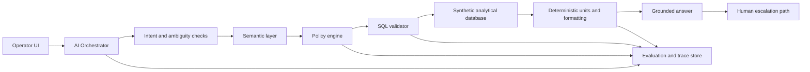

# production-text-to-sql-reference

This is the proposed external reference project for a production-oriented Text-to-SQL architecture. It should not be highlighted as a published portfolio item until the external repository exists.

## Purpose

Demonstrate a nonproduction, synthetic-data-only reference implementation for governed Text-to-SQL in enterprise settings:

- GPT-like operator interface concept
- governed internal data only
- semantic layer
- deterministic authorization
- query validation
- evaluation
- observability
- cost controls
- human escalation

## Architecture



## Proposed Repository Tree

```text
production-text-to-sql-reference/
  README.md
  docs/
    adr/
      0001-governed-semantic-layer.md
      0002-policy-outside-the-model.md
      0003-read-only-query-execution.md
    architecture.md
    evaluation-plan.md
    observability-plan.md
    security-model.md
    test-strategy.md
  apps/
    web/
    api/
  packages/
    semantic-layer/
    policy/
    query-validator/
    evaluator/
    tracing/
  data/
    synthetic/
    migrations/
  tests/
    fixtures/
    e2e/
```

## README Manuscript

```markdown
# production-text-to-sql-reference

A reference architecture for governed Text-to-SQL systems using synthetic data only.

This project demonstrates how a conversational interface can answer enterprise-style data questions while keeping business definitions, authorization, validation, evaluation, observability, and escalation outside the model.

It is not a production product and contains no proprietary code or data.
```

## ADR Template

```markdown
# ADR NNNN: Title

## Status

Proposed | Accepted | Superseded

## Context

What decision is needed and which constraints matter?

## Decision

What will the project do?

## Consequences

What trade-offs, risks, and follow-up work come with this decision?
```

## Security Model

- Use synthetic data only.
- Enforce read-only database credentials.
- Resolve authorization before SQL execution.
- Keep policy outside prompts and model output.
- Deny cross-tenant and restricted-field access deterministically.
- Validate SQL sources, joins, filters, result size, operations, and cost.
- Redact sensitive trace fields.
- Treat prompts, retrieved context, tool arguments, and model output as untrusted.
- Require human confirmation or escalation for high-risk/ambiguous answers.

## Evaluation Plan

- Test intent interpretation, grounding, source selection, SQL validity, authorization, units, formatting, freshness, failure behavior, latency, and cost.
- Include ambiguous questions, unauthorized requests, empty results, stale data, schema changes, unit conversions, and adversarial prompts.
- Store dataset versions, semantic-layer versions, policy versions, prompt versions, and model configuration with each result.
- Block releases on critical authorization, tenant, unit, or unsupported-answer regressions.

## Observability Plan

- Trace each user task across intent, semantic lookup, policy, SQL generation, validation, execution, formatting, response generation, and escalation.
- Record safe structured fields: intent, entities, risk, policy result, schema version, query hash, row count, source freshness, latency, cost, retry count, and final status.
- Avoid storing unrestricted prompts, raw credentials, tokens, or sensitive payloads by default.

## Test Strategy

- Unit tests for semantic definitions, policy rules, SQL validation, and deterministic formatting.
- Integration tests for end-to-end Text-to-SQL workflows over synthetic data.
- Regression tests from evaluation fixtures.
- Security tests for tenant isolation, restricted fields, destructive SQL, unbounded queries, and prompt/tool injection.
- Observability tests for required trace spans and redaction.

## Draft Site Portfolio Entry

Status: not published.

Title: `production-text-to-sql-reference`

Summary: `A synthetic-data reference architecture for governed Text-to-SQL systems with semantic definitions, policy enforcement, SQL validation, evaluation, observability, cost controls, and human escalation.`

Publish only after the external repository exists and has a complete README, runnable synthetic scenario, tests, and security notes.
